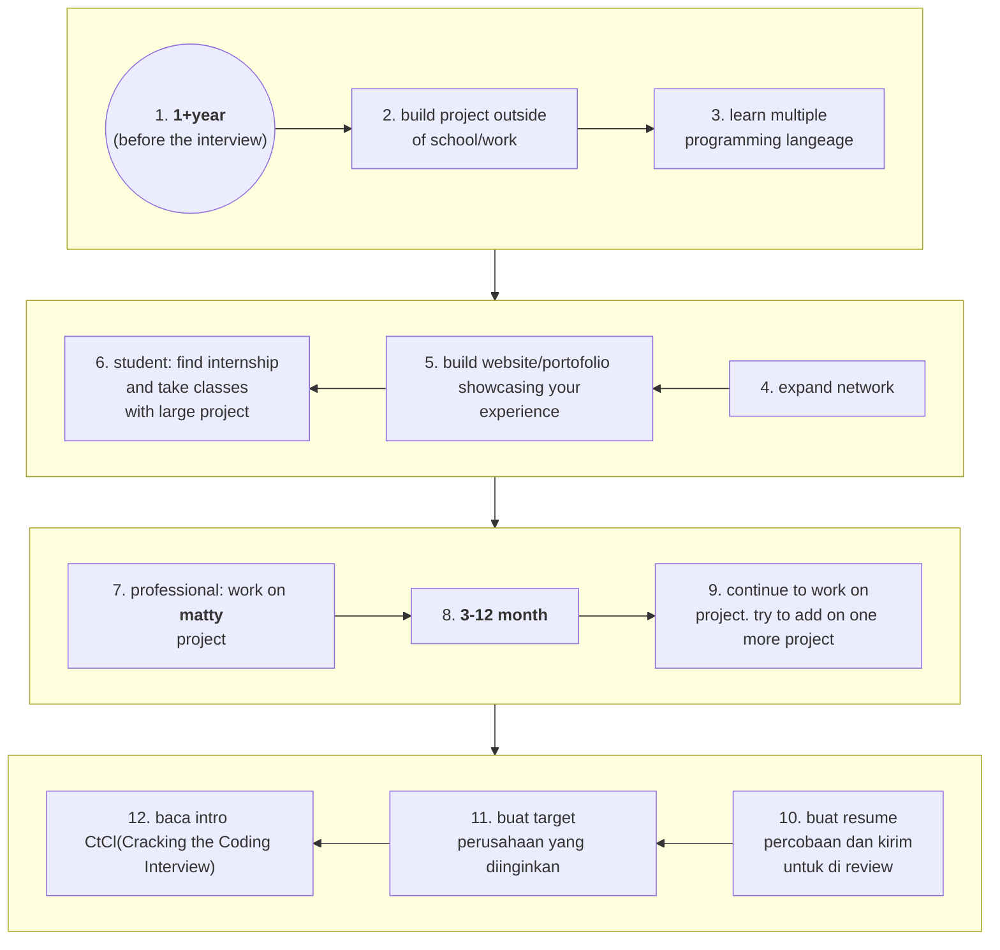

# Apa yang perlu dipelajari
sebelum melakukan interview perlu belajar yak **!!!**  

## Apa yang perlu dipelajari
- [ ] how to design scalable system
- [ ] hacker rank everyday
- [ ] perdalam OOP
- [ ] system architecture
- [ ] great coder and great tester
- [ ] big O

## Before the interview
1. Dapatkan pengalaman yang tepat
    1. ambil project besar
    2. magang ditempat yang bagus
    3. build something
2. Tulis Resume yang bagus 
    1. sebaiknya 1 halaman saja
    2. pengalaman bekerja yang nyambung sama apa yang dilamar
    3. project yang telah dibuat
    4. bahasa pemrograman dan software yang digunakan
    5. hati2 dengan stigma
3. learn master big O 
4. implementasi data struktur dan algoritma dari dasar

