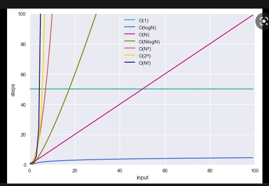

# big O 
## analogi
> bayangkan anda ingin mengirimkan sebuah data ke teman anda yang berada di negara lain
> 
> mungkin akan terpikirkan melalui email atau cloud
>
> apabila gile yang akan dikirimkan ternyata 1 TB atau lebih, maka email atau cloud tidak selamanya akan digunakan, lebih cepat menggunakan pengiriman melalui pengiriman barang

## time complexity
dengan **big O** kita bisa menentukan kecepatan algoritma yang telah dibuat
- electronic transfer: O(s) dimana s adalah besar file yang akan dikirim
- pengiriman barang: O(1) berapapun besar file yang akan dikirim, tidak akan berpengaruh terhadap waktu yang diperlukan file tersebut sampai ke tujuan

### best case, wors case, and expected case
kita dapat menentukan waktu yang dibutuhkan algoritma dengan 3 cara:
1. best case
2. worst case
3. expected case 

## space complexity
hampir sama seperti time complexity 

## drop the constants

