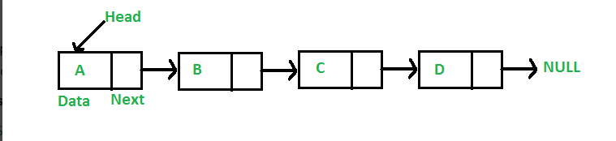

# Data Structure - Linked List 
sumber: https://www.geeksforgeeks.org/linked-list-set-1-introduction/?ref=lbp
> **daftar pustaka** <br />
> 1. [apa linked list](#apa-linked-list) <br />
> 2. [kenapa linked list](#kenapa-linked-list????) <br />
> 3. [keuntungan linked list dari pada arrays](#keuntungan-linked-list-dari-pada-arrays) <br />
> 4. [kekurangan linked list](#kekurangan-linked-list)
> 5. [types of linked list](#types-of-linked-list)
> 6. [gambaran dari linked list](#gambaran-dari-linked-list)
> 7. [time complexity](#time-complexity)
## apa linked list
linked list terdiri dari "*node*" yang mengandung field data dan link ke "*node*" selanjutnya, sesuai dengan gambar dibawah ⬇️

## kenapa linked list????
array dapat digunakan untuk menyimpan data dengan tipe yang sama, tapi array memiliki keterbatasan:
- **besarnya array fix**
    - jadi kita harus tau batas atas dari jumlah elemen. dan juga secara umum alokasi memori = batas atas terlepas dari penggunaan
    - jadi alokasi memori akan sama meskipun tidak dipakai sepenuhnya (**begitukah**)
- **penambahan atau pengurangan elemen di dalam array sangant mahal**
    - ruangan untuk menambah elemen baru harus dibuat, dan untuk membuat ruangan yang sudah ada pemiliknya(elemen), maka elemen harus di geser. **berbeda** dengan linked list jika kita memiliki "*head node*", kita bisa melintas ke "*node*" yang lain melalui nya dan menambahkan "*node*" pada posisi yang dibutuhkan.

**contoh:**<br/>
pada sebuah sistem, jika kita menginginkan sebuah list ID yang sudah di sort di `array id[] = [1000, 1010, 1050, 2000, 2040]`<br/>
jika kita ingin menambahkan ID baru 1005, untuk menjaga urutan list, kita harus memindahkan ID setelah 1000. <br/>
menghapus elemen juga sangat "*mahal*" harus dipindahkan dulu baru nanti di masukkan lagi
## keuntungan linked list dari pada arrays
- dynamic array
- mudah menambahkan dan menghapus
## kekurangan linked list
- tidak bisa random access. kita harus access elemen berurutan dari "*head*". jadi kita **tidak bisa** melakukan "*binary search*" secara efisien.
- extra memori dibutuhkan untuk pointer disetiap "*node*"
- not cache friendly. **ga paham**
## types of linked list 
- **simple linked list** - pada tipe ini, seseorang dapat bergerak atau berpindah tempat hanya satu arah
- **doubly linked ilst** - pada tipe ini, seseorang dapat bergerak atau berpindah 2 arah (kedepan dan kebelakang)
- **circular linked list** - pada tipe ini, "*node*" terakhir di linked list mengandung link ke "*head node*" dan pada "*head node*" mengandung link ke "*last node*" sebelum "*pointer*"
## gambaran dari linked list
linked list di gambarkan dengan pointer pada "*node*" pertama ("*head node*") <br/>
setiap "*node*" mengandung 2 bagian:
- data 
- pointer (atau referensi) ke "*node*" selanjutnya, atau alamat ke "*node*" yg lain

```python
# Node class
class Node:
  
  # Function to initialize the node object
  def __init__(self, data):
    self.data = data # assign data 
    self.next = None # initialize

# Linked List class
class LinkedList:
  
# Function to initialize the linked 
# list object 
  def __init__(self):
    self.head = None

  def printList(self):
    tmp = self.head 
    while (temp):
      print(tmp.data)
      tmp = tmp.next


# code execution starts here
if __name__ == '__main__':

  # start with the empty list 
  llist = LinkedList()

  llist.head = Node(1)
  second = Node(2)
  third = Node(3)

  '''
  Three nodes have been created.
  We have references to these three blocks as head,
  second and third

  llist.head        second              third
       |                |                  |
       |                |                  |
  +----+------+     +----+------+     +----+------+
  | 1  | None |     | 2  | None |     |  3 | None |
  +----+------+     +----+------+     +----+------+
  '''

  llist.head.next = second  # Link first node with second

  '''
  Now next of first Node refers to second.  So they
  both are linked.

  llist.head        second              third
       |                |                  |
       |                |                  |
  +----+------+     +----+------+     +----+------+
  | 1  |  o-------->| 2  | null |     |  3 | null |
  +----+------+     +----+------+     +----+------+
  '''

  second.next = third  # Link second node with the third node

  '''
  Now next of second Node refers to third.  So all three
  nodes are linked.

  llist.head        second              third
       |                |                  |
       |                |                  |
  +----+------+     +----+------+     +----+------+
  | 1  |  o-------->| 2  |  o-------->|  3 | null |
  +----+------+     +----+------+     +----+------+
  '''
  llist.printList() # menjalankan fungsi printList pada LinkedList 
```

## time complexity
| time complexity | worst case | average case |
| ---- | ---- | ---- |
| search | O(n) | O(n) |
| insert | O(1) | O(1) |
| delete | O(1) | O(1) |
