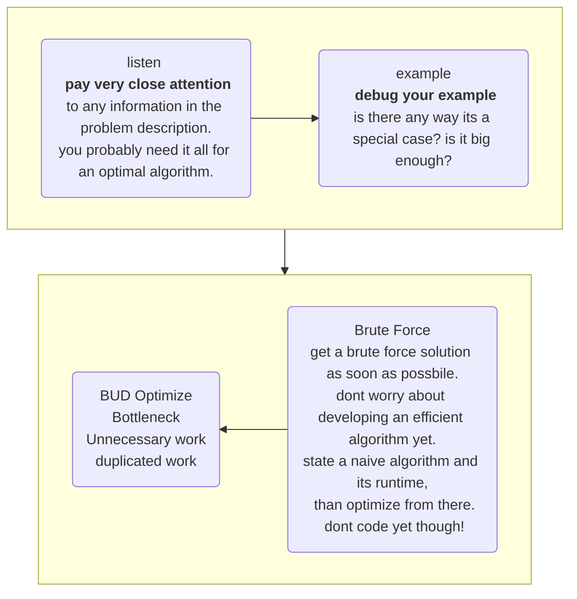

# Technical Question
## How To Prepare
lakukan hal-hal berikut:
1. try to solve the problem on your own
2. write the code on paper
3. test your code - on paper
4. type your code as-is into a computer. kamu mungkin akan menemukan kesalahan, catat kesalahan tersebut jadi kamu bisa menyimpannya di memeori selama interview berlangsung
5. do as many mock interview 

## what you need to know
### core data structure, algorithms, and concept
- know the basic of data structure
- know the basic of algorithm
- must have knowledge

| data structure | algorithm | concept |
| ---- | ---- | ---- | 
| linked list | breadth-first search | bit manipulation |
| tree, tries & graph | depth-first search | memory (stack vs heap) |
| stack & queues | binary search | recursion |
| heap | merge sort | dynamic programming |
| vector / arrayList | quick sort | big o time & space |
| hash table | |

**noted:** make sure understand how to use and implementing them, and where applicable, the space and time complexity

### powers of 2 table 
- berguna untuk pertanyaan tentang "***scalability***" atau "***sort of memory limitaion***" 

| power of 2 | exact value (x) | appox. value | x bytes int MB, GB, etc |
| ---- | ---- | ---- | ---- |
| 7 | 128 | | |
| 8 | 256 | | |
| 10 | 1024 | 1 thousand | 1 KB |
| 16 | 65.536 | | 64 KB |
| 20 | 1.048.576 | 1 million | 1 MB |
| 30 | 1.073.741.824 | 1 billion | 1 GB |
| 32 | 4.294.967.296 | | 4 GB |
| 40 | 1.099.511.627.776 | 1 trillion | 1 TB |

## walking through a problem
### Problem Solving Flowchart

